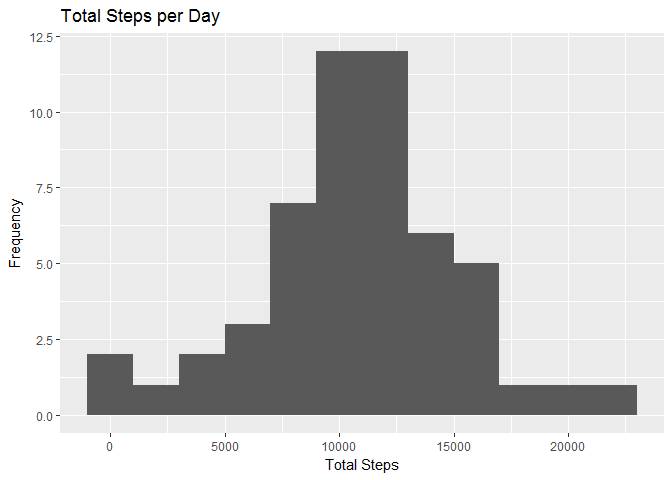
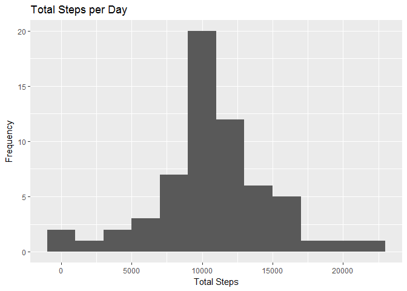

# Reproducible Research: Peer Assessment 1


## Loading and preprocessing the data
Download and unzip the data, and read it into a dataframe.  View the initial structure of the data

```r
#download and unzip
download.file("https://d396qusza40orc.cloudfront.net/repdata%2Fdata%2Factivity.zip", destfile = "data_zipped")
unzip("data_zipped")

#load
df <- read.csv("activity.csv", na.strings = c("NA"))

#check structure
str(df)
```

```
## 'data.frame':	17568 obs. of  3 variables:
##  $ steps   : int  NA NA NA NA NA NA NA NA NA NA ...
##  $ date    : Factor w/ 61 levels "2012-10-01","2012-10-02",..: 1 1 1 1 1 1 1 1 1 1 ...
##  $ interval: int  0 5 10 15 20 25 30 35 40 45 ...
```
  
Use the `dplyr` and `lubridate` packages to convert the date variable to a POSIXct class variable.  Then view some initial summary statistics on the dataset


```r
library(dplyr)
library(lubridate)
df <- mutate(df,date = ymd(date))
str(df)
```

```
## 'data.frame':	17568 obs. of  3 variables:
##  $ steps   : int  NA NA NA NA NA NA NA NA NA NA ...
##  $ date    : Date, format: "2012-10-01" "2012-10-01" ...
##  $ interval: int  0 5 10 15 20 25 30 35 40 45 ...
```

```r
summary(df)
```

```
##      steps             date               interval     
##  Min.   :  0.00   Min.   :2012-10-01   Min.   :   0.0  
##  1st Qu.:  0.00   1st Qu.:2012-10-16   1st Qu.: 588.8  
##  Median :  0.00   Median :2012-10-31   Median :1177.5  
##  Mean   : 37.38   Mean   :2012-10-31   Mean   :1177.5  
##  3rd Qu.: 12.00   3rd Qu.:2012-11-15   3rd Qu.:1766.2  
##  Max.   :806.00   Max.   :2012-11-30   Max.   :2355.0  
##  NA's   :2304
```
## What is mean total number of steps taken per day?
Calculate the total number of steps per day.  Include in this an indicator for every single observation for a given day being a missing value.

```r
day_total <- df %>%
  group_by(date) %>%
  summarise(tot_steps = sum(steps, na.rm=TRUE),
            all_na = mean(is.na(steps))
            ) 
head(day_total)
```

```
## # A tibble: 6 x 3
##         date tot_steps all_na
##       <date>     <int>  <dbl>
## 1 2012-10-01         0      1
## 2 2012-10-02       126      0
## 3 2012-10-03     11352      0
## 4 2012-10-04     12116      0
## 5 2012-10-05     13294      0
## 6 2012-10-06     15420      0
```

```r
summary(day_total$tot_steps)
```

```
##    Min. 1st Qu.  Median    Mean 3rd Qu.    Max. 
##       0    6778   10395    9354   12811   21194
```
  In order to caluclate the mean and median total steps taken per day, exclude any days where every observation is missing

```r
day_total <- filter(day_total, !(all_na==1))
```


Plot a histogram of the total number of steps per day using the `ggplot2` package:

```r
library(ggplot2)
ggplot(day_total, aes(x = tot_steps)) +
  geom_histogram(binwidth = 2000) +
  labs(title = "Total Steps per Day", x = "Total Steps", y = "Frequency")
```

<!-- -->


Now calculate the mean and median total steps per day:

```r
mean_steps_per_day <- mean(day_total$tot_steps, na.rm=TRUE)
median_steps_per_day <- median(day_total$tot_steps, na.rm=TRUE)
```

The mean steps per day is 10766.19, and the median is 10765.

## What is the average daily activity pattern?


First, calculate the average steps per interval across all days

```r
interval_mean <- df %>%
  group_by(interval) %>%
  summarise(avg_steps = mean(steps, na.rm=TRUE))

summary(interval_mean)
```

```
##     interval        avg_steps      
##  Min.   :   0.0   Min.   :  0.000  
##  1st Qu.: 588.8   1st Qu.:  2.486  
##  Median :1177.5   Median : 34.113  
##  Mean   :1177.5   Mean   : 37.383  
##  3rd Qu.:1766.2   3rd Qu.: 52.835  
##  Max.   :2355.0   Max.   :206.170
```

Below is a time series plot of the 5 minute interval, and the average number of steps taken, averaged across all days


```r
plot(interval_mean$interval,interval_mean$avg_steps, type="l", xlab="Interval", ylab="Number of Steps",main="Average Number of Steps per Day by Interval")
```

<!-- -->


We can also calculate the 5 minute interval across all days containing the highest number of average steps:

```r
max_interval <- as.numeric(interval_mean[which.max(interval_mean$avg_steps),1])
```

On average across all days in the dataset, the 5 minute interval with the maximum number of steps is interval 835.


## Imputing missing values
The total number of mising values in the dataset is now calculated:

```r
na_count = sum(!complete.cases(df))
```

In total, there are 2304 rows in the dataset with missing values.


These missing values will now be imputed.  The method of imputation used will be to replace `NA`'s with the mean value for a given 5 minute interval over all days, as calculated above in the `interval_mean` dataframe.

```r
df_imputed <- mutate(df, steps=ifelse(is.na(df$steps),interval_mean$avg_steps[match(df$interval, interval_mean$interval)],df$steps))
summary(df_imputed$steps)
```

```
##    Min. 1st Qu.  Median    Mean 3rd Qu.    Max. 
##    0.00    0.00    0.00   37.38   27.00  806.00
```


With these missing values imputed, we can now recreate the summary and histogram of total steps per day found above:


```r
#summarise
day_total_2 <- df_imputed %>%
  group_by(date) %>%
  summarise(tot_steps = sum(steps, na.rm=TRUE))

#plot
ggplot(day_total_2, aes(x = tot_steps)) +
  geom_histogram(binwidth = 2000) +
  labs(title = "Total Steps per Day", x = "Total Steps", y = "Frequency")
```

<!-- -->


The mean and median can also be recalculated

```r
mean_steps_per_day_2 <- mean(day_total_2$tot_steps, na.rm=TRUE)
median_steps_per_day_2 <- median(day_total_2$tot_steps, na.rm=TRUE)
```


The mean total number of steps with missing values imputed is 10766.19 and the median is 10766.19.  The mean has not changed compared to the original calculation, when any days with entirely missing values were removed from the dataset.  This is to be expected, as every interval within these missing days was replaced with the mean for that interval over all other days.  Therefore, the total number of steps for each of these days will just have been replaced with the mean total steps per day for the rest of the dataset; the overall mean will therefore be unchanged.  The median has changed slightly, and is now identical to the mean.


## Are there differences in activity patterns between weekdays and weekends?
A new factor variable will now be defined, indicating whether a given date is a "weekday" or "weekend"


```r
df_daytype <- df_imputed %>%
  mutate(daytype=factor(ifelse(weekdays(date) %in% c("Saturday", "Sunday"),"weekend", "weekday")))

summary(df_daytype$daytype)
```

```
## weekday weekend 
##   12960    4608
```


The previously calculated summary of the mean interval for each 5 minute period over all days can now be recalculated, also splitting over the `daytype` variable defined above.  For this analysis, the dataset with missing values imputed will be used.


```r
interval_mean_2 <- df_daytype %>%
  group_by(daytype, interval) %>%
  summarise(avg_steps = mean(steps, na.rm=TRUE))
```

In the below panel plot, the time series showing the average number of steps taken across 5 minute intervals can be compared for weekdays and weekends


```r
library(lattice)

xyplot(interval_mean_2$avg_steps ~ interval_mean_2$interval|interval_mean_2$daytype, type="l", xlab="Interval", ylab="Number of Steps", main="Average Number of Steps per Day by Interval",layout=c(1,2))
```

<!-- -->
